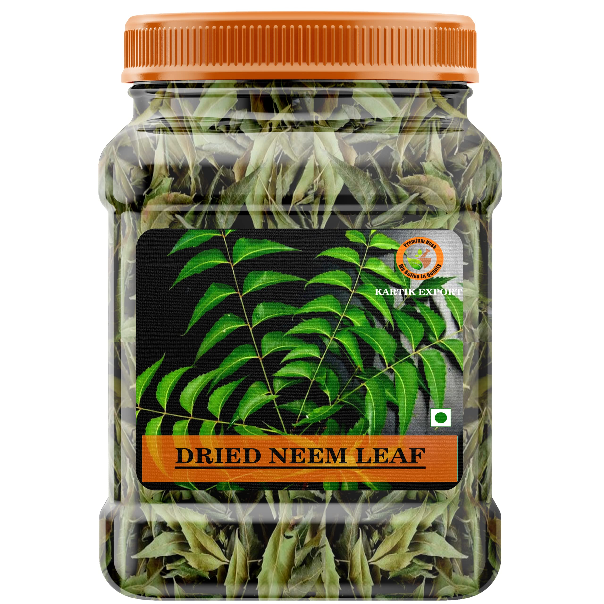

# karibunourish
Karibu Nourish
# Karibu Nourish

Welcome to Karibu Nourish – Your Destination for Health and Flavor!

## About Us

At Karibu Nourish, we believe in redefining health through a curated selection of powders and beverages that enhance your well-being. Our products are crafted with care, offering a blend of rich flavors and beneficial nutrients to support your health journey.

## Our Products

### Powders

1. **Neem Powder**
   - Description: Harness the power of neem for its numerous health benefits.
   - Image: 

2. **Moringa Powder**
   - Description: Packed with nutrients, Moringa powder is a superfood for vitality.
   - Image: 

3. **Hibiscus Powder**
   - Description: Enjoy the vibrant taste and health benefits of hibiscus.
   - Image: 

4. **Vanilla Powder**
   - Description: Indulge in the sweet aroma and flavor of pure vanilla.
   - Image: 

5. **Cloves Powder**
   - Description: Experience the aromatic and healthful properties of cloves.
   - Image: 

6. **Wimbi Powder**
   - Description: Wimbi, or finger millet, offers a unique and nutritious powder.
   - Image: 

### Beverages

1. **Karibu Chai**
   - Description: Invigorating chai that can be enjoyed either packed or served on-site.
   - Image: 

2. **Chai Dawa**
   - Description: Chai with healing properties, available in convenient packaging.
   - Image: 

3. **Hibiscus Tea**
   - Description: Refreshing hibiscus tea, packed with antioxidants.
   - Image: 

4. **Sea Moss Beverage**
   - Description: Boost your health with the goodness of sea moss in a delightful drink.
   - Image: 

### Special Blends

1. **Baby Weaning Mix**
   - Description: Thoughtfully crafted blend for the weaning stages of your little one.
   - Image: 

2. **Senior's Mix**
   - Description: Specially formulated mix for the nutritional needs of seniors.
   - Image: 

3. **Teens Mix**
   - Description: A blend to support the energy and growth requirements of teenagers.
   - Image: 

### Additional Products

- **Dania Powder**
- **Black Pepper**
- **Ginger**
- **Corn Starch**
- **Cumin Powder**
- **Cinnamon**
- **Soy Powder**
- **Tea Masala**
- **Special Mix**
- **Masala**
- **Ashwagandha**

## Pricing

We are committed to making quality health accessible to everyone. Our prices are designed to be subsidized, ensuring your well-being without compromise.

Feel free to explore our products and embark on a journey to a healthier, more vibrant you!

---

**Note:** This README is a template. Please replace placeholder information with actual details about your products, and use actual image URLs.
